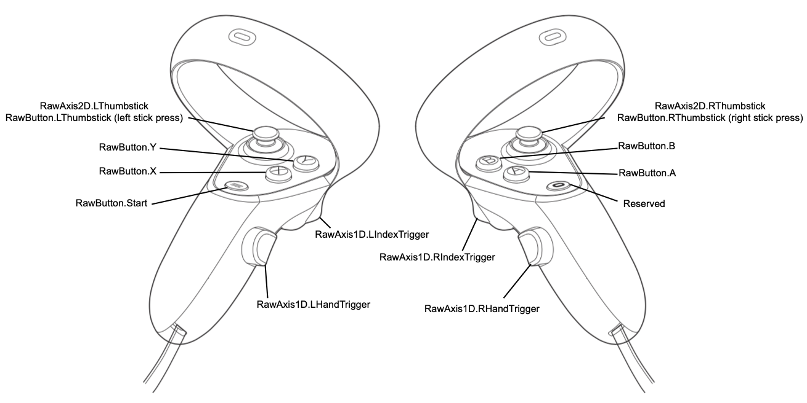
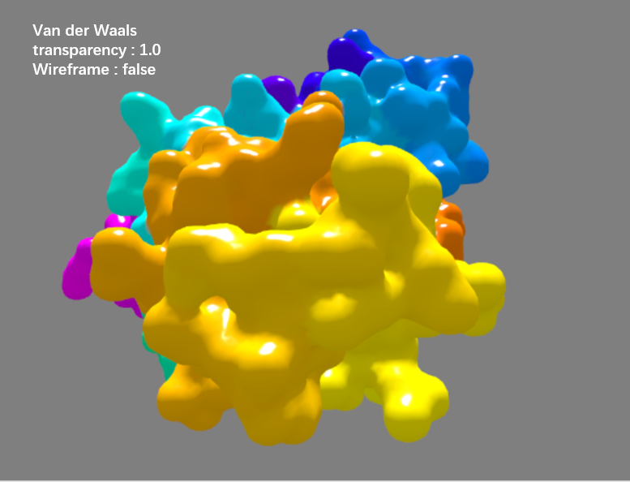

Contents
====

- [Overview](#Overview)
- [Quick Start](#quick-start)
    - [Installing Falcon2-VR](#installing-siga)
    - [Running Falcon2-VR](#Running-Falcon2-VR)
    - [Implement](#Implement)
- [Geting Start VR Mode](#Geting-Start-VR-Mode)
    - [Enter VR Scene](#Enter-VR-Scene)
    - [VR Menu](#VR-Menu)
    - [Loading PDB](#Loading-PDB)
    - [Drag PDB](#Drag-PDB)
    - [Design PDB](#Design-PDB)
    - [Surface](#Surface)
    - [Color](#color)
    - [Align](#align)
    - [Docking](#docking)
    - [Energy](#energy)
    - [RefineStructure](#refineStructure)

* [Citation](#citation)
* [FAQ](#faq)
* [Support](#support)
* [Authors](#authors)

Overview
========

Falcon-VR 是一个基于 Three.js 开发的先进蛋白质设计工具，旨在为研究人员和生物学家提供沉浸式的虚拟现实体验。通过利用最新的 WebVR 技术，Falcon-VR 提供了一个功能强大的平台，使用户能够在无限的虚拟环境中直观地设计和可视化蛋白质结构。

Quick Start
===========

## Installing Falcon2-VR
### Requirements
```
git clone https://github.com/bigict/falcon2.git
```

```
cd falcon2
pip install -r requirements.txt
```

## Running Falcon2-VR

### Quickstart
```
cd falcon2/server
uvicorn app:app --host ip_address --port port
```
使用VR头盔直接访问 ip_address

### Implement

<table>
  <tr>
    <th style="text-align: left;">参数</th>
    <th style="text-align: left;">示例</th>
    <th style="text-align: left;">描述</th>
  </tr>
  <tr>
    <td style="text-align: left;">Tools</td>
    <td style="text-align: left;">"design","docking","energy","align"</td>
    <td style="text-align: left;">该参数表示工具所实现的特定功能或工作目标。例如，“design”蛋白质设计；“docking”对接工具；“energy”能量计算工具；“align”对齐工具。</td>
  </tr>
  <tr>
    <td style="text-align: left;">Name</td>
    <td style="text-align: left;">"ProDESIGN","HDock"</td>
    <td style="text-align: left;">该参数代表工具的具体名称，如“ProDESIGN”或“HDock”等。每个名称对应一个特定的工具，能够执行相应的功能。</td>
  </tr>
  <tr>
    <td style="text-align: left;">Address</td>
    <td style="text-align: left;">"https://0.0.0.0:9098/design"</td>
    <td style="text-align: left;">该参数表示工具对应的网络地址或访问路径，例如"https://0.0.0.0:9098/design" 。这个地址用于在网络环境中访问和使用相应的工具，确保用户能够通过浏览器或API接口进行操作。</td>
  </tr>
</table>

## Geting Start VR Mode

VR设备：

| Oculus Quest                                                        |
|:--------------------------------------------------------------------|
|  |
|    |

### Enter VR Scene

首先：VR程序启动，需要一个支持WebXR的浏览器。例如Google Chrome、Microsoft Edge、Firefox Reality等。

点击屏幕上`ENTER VR`按钮，进入VR模式。如图：


### VR Menu

点击VR屏幕中的,弹出VR中的菜单，实现VR的功能交互：


### Loading PDB

点击`Menu`菜单中的`load PDB`按钮，加载PDB。PDB文件需提前放至`client/static/data`目录下, PDB ID会在点击`load PDB`
后，显示出来。选择目标PDB ID，加载PDB。

### Drag PDB

Drag按钮用于在PDB结构中拖动特定的元素。通过选择"Drag Chain"、"Drag Residue"、"Drag Residue"或"Drag Residue"，可以在 VR
场景中拖动结构中的单个链、配体、残基或药物。


### Design PDB

蛋白质设计提供了一套强大的工具，用于在分子水平上修改蛋白质结构。请按照以下步骤设计您的蛋白质：

访问蛋白质设计工具：

从主 VR 菜单进入 `Design` 模式。
从子菜单中选择 `Region` ，这将提供选项以选择要修改的蛋白质区域。

选择设计区域：

使用指针或手选择您希望设计的蛋白质区域。
选中后所选区域将会被高亮显示，表明它已准备好进行修改。

基于结构优化序列：

将选定的蛋白质结构区域传递至Python端的蛋白质设计软件，让软件根据当前的蛋白质结构重新设计该区域的序列，从而实现新蛋白质的设计。根据不同的蛋白质设计工具，会导出该蛋白质的序列`.fasta`文件或`.pdb`文件

保存并退出：

完成工作后保存并退出设计模式。

### Surface

`Surface`使用的是范德华力表面。通过调整透明度0.2-1.0，有0.2、0.4、0.6、0.8、1.0



### Color

通过VR
Menu的颜色的菜单，可以根据`元素（Element）`、`残基（Residue）`、`二级结构（SecStructure）`、`链（Chain）`、`蛋白质（PDB）`、`疏水性（HYDROPHOBICITY）`
等方式进行多样化修改颜色。

| `蛋白质（PDB）`                                                            | `元素（Element）`                                                             | `残基（Residue）`                                                             | `二级结构（SecStructure）`                                                 |
|:----------------------------------------------------------------------|:--------------------------------------------------------------------------|:--------------------------------------------------------------------------|:---------------------------------------------------------------------|
| 使用`Spectrum`从冷色调到暖色调的颜色渐变。                                            | 使用`Spectrum`从冷色调到暖色调的颜色渐变。                                                | 使用`Spectrum`从冷色调到暖色调的颜色渐变。                                                | 使用`Spectrum`从冷色调到暖色调的颜色渐变。                                           |
|  |  |  |  | 

### Align

`Align`功能是用于蛋白质结构对比的关键工具。

首先通过精确的序列比对算法，确定两条蛋白质链之间的最佳匹配区段。随后，基于序列比对的结果，进行结构比对，将两个蛋白质的三维结构进行精确的空间对齐。

该功能不仅能够帮助用户识别蛋白质之间的结构相似性，还可以用于分析同源蛋白质的结构差异、研究结构上的保守性区域，以及探讨蛋白质结构与功能之间的关系。Align工具为蛋白质结构生物学家提供了直观且高效的手段，以在虚拟现实环境中对复杂的生物分子进行详细的比较分析。


### Docking

蛋白质对接`Docking`是一种计算方法，用于预测两个蛋白质如何结合在一起以形成稳定的复合物。首先，选择合适的蛋白质对接工具，例如
`HDOCK` 等。接着，选定两个蛋白质——一个作为受体，另一个作为配体，并将它们提交给对接服务进行分析。最终，您将获得蛋白质对接的结果。

### Energy

采用`dfire`等蛋白质能量打分工具，对蛋白质结构的能量做打分。


Citation
========

```
@article{10.1093/bioinformatics/btaa696,
    author = {Xu, Kui and Liu, Nan and Xu, Jingle and Guo, Chunlong and Zhao, Lingyun and Wang, Hong-Wei and Zhang, Qiangfeng Cliff},
    title = "{VRmol: an Integrative Web-Based Virtual Reality System to Explore Macromolecular Structure}",
    journal = {Bioinformatics},
    year = {2020},
    month = {08},
    issn = {1367-4803},
    doi = {10.1093/bioinformatics/btaa696},
    url = {https://doi.org/10.1093/bioinformatics/btaa696},
    note = {btaa696},
    eprint = {https://academic.oup.com/bioinformatics/advance-article-pdf/doi/10.1093/bioinformatics/btaa696/33560033/btaa696.pdf},
}
```

FAQ
====

Support
=======

Authors
=======
